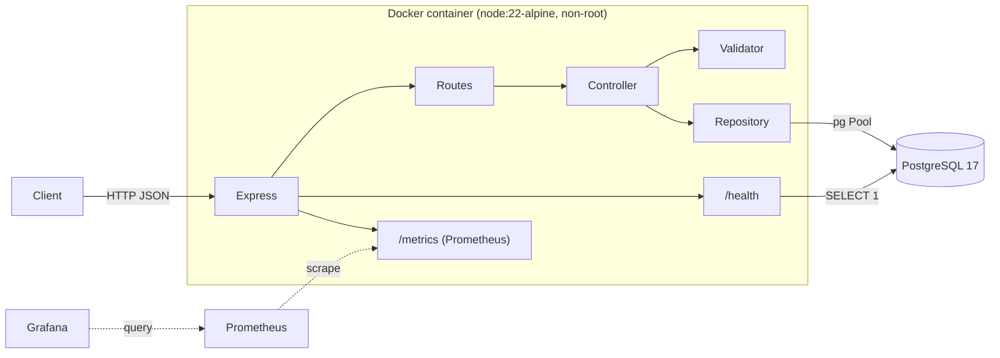
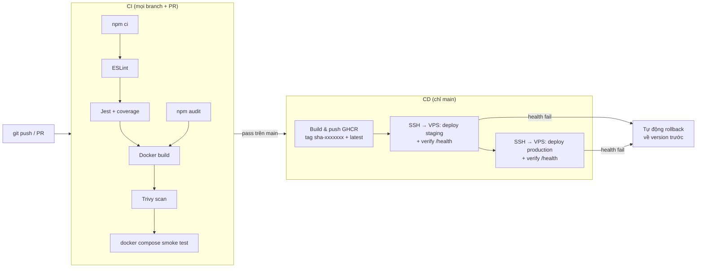

# Intro to DevOps – Todo REST API

[](https://github.com/AlexanderPhan04/Intro-to-DevOps/actions/workflows/ci.yml)
[](https://github.com/AlexanderPhan04/Intro-to-DevOps/actions/workflows/cd.yml)

Bài tập cá nhân **DevOps cho ứng dụng Web Node.js**: REST API quản lý Todo (Express 5 + PostgreSQL), được Docker hoá và triển khai tự động bằng GitHub Actions lên VPS riêng (Docker, deploy qua SSH).

| | |
|---|---|
| Họ tên | _<Họ và tên>_ |
| Mã số học viên | _<MSHV>_ |
| Lớp | _<Lớp>_ |
| App (production) | https://todo.alexanderphan.dev |
| App (staging) | chạy nội bộ trên VPS (`127.0.0.1:9101`), không public |
| Video demo | _<link YouTube>_ |

---

## 1. Kiến trúc

### Ứng dụng



Code được tách lớp theo trách nhiệm và dùng dependency injection (`createApp({ todoRepository, checkDatabase, logger })`), nhờ vậy unit test chạy với repository in-memory mà không cần database thật.

| Lớp | Thư mục | Trách nhiệm |
|---|---|---|
| Config | `src/config` | Đọc biến môi trường (`dotenv`), không hardcode secrets |
| Routes | `src/routes` | Khai báo endpoint |
| Controller | `src/controllers` | Xử lý HTTP request/response |
| Validator | `src/validators` | Kiểm tra dữ liệu đầu vào |
| Repository | `src/repositories` | Truy vấn SQL có tham số (chống SQL injection) |
| Database | `src/database` | Tạo connection pool, migration |
| Middlewares | `src/middlewares` | Request logging (Morgan → Winston), xử lý lỗi tập trung |
| Monitoring | `src/monitoring` | Prometheus metrics (`prom-client`) |

### CI/CD



---

## 2. Cấu trúc thư mục

```
.
├── .github/
│   ├── workflows/ci.yml        # Lint, test, audit, build, Trivy, smoke test
│   ├── workflows/cd.yml        # Push image GHCR + deploy staging → production
│   ├── workflows/deploy-vps.yml# Reusable: SSH vào VPS và deploy một environment
│   ├── workflows/rollback.yml  # Rollback thủ công
│   └── dependabot.yml
├── deploy/
│   └── docker-compose.prod.yml # Compose chạy trên VPS (app + postgres riêng)
├── monitoring/                 # Prometheus + Grafana (dashboard provisioned sẵn)
├── scripts/
│   └── remote-deploy.sh        # Chạy trên VPS: deploy + health check + auto rollback
├── src/
│   ├── app.js                  # Tạo Express app (không listen)
│   ├── server.js               # Khởi động: migrate, listen, graceful shutdown
│   ├── config/ controllers/ database/ middlewares/
│   └── monitoring/ repositories/ routes/ utils/ validators/
├── tests/                      # Jest + Supertest
├── Dockerfile                  # Multi-stage, alpine, non-root, HEALTHCHECK
├── docker-compose.yml          # app + postgres (+ prometheus, grafana)
└── .env.example
```

---

## 3. API

Base URL: `http://localhost:9000`

| Method | Endpoint | Mô tả | Body |
|---|---|---|---|
| GET | `/api/todos` | Lấy danh sách todo | – |
| GET | `/api/todos/:id` | Lấy một todo | – |
| POST | `/api/todos` | Tạo todo | `{ "title": "Learn Docker" }` |
| PUT | `/api/todos/:id` | Cập nhật todo | `{ "title"?: string, "completed"?: boolean }` |
| DELETE | `/api/todos/:id` | Xoá todo | – |
| GET | `/health` | Health check (kèm trạng thái DB, version) | – |
| GET | `/metrics` | Prometheus metrics | – |

Mã lỗi: `400` dữ liệu/ID không hợp lệ, `404` không tìm thấy, `500` lỗi server (không lộ chi tiết lỗi ra ngoài), `503` từ `/health` khi DB không kết nối được.

Ví dụ:

```bash
curl -X POST http://localhost:9000/api/todos -H "Content-Type: application/json" -d '{"title":"Learn Docker"}'
curl http://localhost:9000/api/todos
curl -X PUT http://localhost:9000/api/todos/1 -H "Content-Type: application/json" -d '{"completed":true}'
curl -X DELETE http://localhost:9000/api/todos/1
```

---

## 4. Chạy local

### Cách 1 – Docker Compose (khuyến nghị)

Yêu cầu: Docker Desktop.

```bash
cp .env.example .env          # tuỳ chọn, compose có giá trị mặc định
docker compose up --build
```

- API: http://localhost:9000
- Bảng `todos` được tạo tự động khi app khởi động (migration có retry).

Kèm monitoring:

```bash
docker compose --profile monitoring up --build
```

- Prometheus: http://localhost:9090
- Grafana: http://localhost:3000 (user/password theo `GRAFANA_ADMIN_USER` / `GRAFANA_ADMIN_PASSWORD`), dashboard **Todo API Overview** đã được cấu hình sẵn.

Dừng và xoá dữ liệu: `docker compose down -v`

### Cách 2 – Node.js trực tiếp

Yêu cầu: Node.js >= 18 và một PostgreSQL đang chạy trên `localhost:5432`.

```bash
npm ci
cp .env.example .env          # sửa DATABASE_URL nếu cần
npm run dev
```

### Lệnh hữu ích

| Lệnh | Mô tả |
|---|---|
| `npm run dev` | Chạy với auto-reload |
| `npm start` | Chạy production |
| `npm run lint` | ESLint |
| `npm test` | Jest |
| `npm run test:ci` | Jest + coverage + JUnit report |
| `npm run migrate` | Chạy migration thủ công |

### Biến môi trường

| Biến | Mặc định | Mô tả |
|---|---|---|
| `PORT` | `9000` | Cổng HTTP |
| `NODE_ENV` | `development` | `production` → log dạng JSON |
| `LOG_LEVEL` | `http` | `error` / `warn` / `info` / `http` / `debug` |
| `DATABASE_URL` | – (bắt buộc) | Connection string PostgreSQL |
| `DATABASE_SSL` | `false` | `true` cho DB managed yêu cầu TLS |
| `METRICS_TOKEN` | rỗng | Nếu đặt, `/metrics` yêu cầu `Authorization: Bearer <token>` |
| `APP_VERSION` | `dev` | Được gán lúc build image (`sha-xxxxxxx`), trả về trong `/health` |

---

## 5. CI pipeline (`.github/workflows/ci.yml`)

Chạy khi **push lên mọi branch** và **pull request vào `main`**. Bất kỳ bước nào fail thì pipeline dừng.

1. **Lint & Test** (matrix Node 20 và 22): `npm ci` → `npm run lint` → `npm run test:ci`. Ngưỡng coverage tối thiểu 80%, dưới ngưỡng là fail.
2. **Báo cáo test**: kết quả Jest hiển thị dạng check run "Jest results" (dorny/test-reporter), bảng coverage hiển thị trong Job Summary, thư mục coverage được upload làm artifact.
3. **Dependency audit**: `npm audit --omit=dev --audit-level=high`.
4. **Docker**: build image → **Trivy** scan (fail nếu có lỗ hổng HIGH/CRITICAL đã có bản vá) → `docker compose up --wait` rồi smoke test CRUD + `/health` + `/metrics`.

## 6. CD pipeline (`.github/workflows/cd.yml`)

Chỉ chạy khi workflow **CI hoàn thành thành công** cho một lần **push/merge vào `main`** (trigger `workflow_run`), hoặc chạy tay qua `workflow_dispatch`.

1. **Build & push** image lên **GitHub Container Registry** (`ghcr.io/<owner>/intro-devops-api`) với 2 tag: `sha-<7 ký tự commit>` (bất biến, dùng để rollback) và `latest`. Đăng nhập bằng `GITHUB_TOKEN` tự cấp, không cần thêm tài khoản.
2. **Deploy staging** (`deploy-vps.yml`): SSH vào VPS, upload `deploy/docker-compose.prod.yml` + `scripts/remote-deploy.sh` vào `/opt/intro-devops/staging`, tạo file `.env` trên server từ GitHub Secrets, rồi chạy `remote-deploy.sh <tag>`.
3. **Deploy production**: chỉ chạy khi staging thành công, thư mục `/opt/intro-devops/production`. Có thể bật **Required reviewers** để duyệt tay trước khi deploy.
4. **Kiểm tra sau deploy**: `docker compose up --wait` chờ container healthy (HEALTHCHECK gọi `/health`), sau đó runner gọi `APP_URL/health` từ Internet và so sánh `version` với tag vừa deploy.
5. **Rollback tự động**: `remote-deploy.sh` lưu tag đang chạy (`.current_tag`, `.previous_tag`). Nếu bản mới không healthy, script tự chạy lại bản cũ và pipeline báo fail.

Mỗi environment là một compose project riêng (`intro-devops-staging`, `intro-devops-production`) với PostgreSQL và volume riêng, không đụng tới các container khác trên server. Thông tin đăng nhập GHCR được lưu trong `DOCKER_CONFIG` riêng của thư mục deploy và bị logout sau mỗi lần deploy.

**Rollback thủ công**:

- Trên GitHub: Actions → **Rollback** → *Run workflow* → chọn environment, nhập tag (vd. `sha-1a2b3c4`) hoặc để trống để quay về bản trước.
- Trên server:

  ```bash
  bash /opt/intro-devops/production/remote-deploy.sh --rollback
  ```

---

## 7. Hướng dẫn deploy lên VPS

Yêu cầu server: Linux có Docker Engine + Docker Compose v2 (aaPanel → Docker đã cài sẵn), truy cập SSH.

### Bước 1 – Tạo SSH key riêng cho GitHub Actions

Trên máy cá nhân:

```bash
ssh-keygen -t ed25519 -C "github-actions-deploy" -f deploy_key -N ""
```

Thêm public key vào server (user có quyền chạy `docker`, vd. `root`):

```bash
ssh root@103.12.77.228 "mkdir -p ~/.ssh && cat >> ~/.ssh/authorized_keys" < deploy_key.pub
```

Kiểm tra: `ssh -i deploy_key root@103.12.77.228 docker compose version`.

Nội dung file `deploy_key` (private key) sẽ đưa vào GitHub Secret ở Bước 3. Sau đó xoá file khỏi máy, **không commit**.

### Bước 2 – Mở port trên server

Mặc định production chạy ở port `9100`, staging ở `9101` (chọn port chưa dùng trên server). Vào aaPanel → **Security** → thêm rule cho phép TCP `9100` và `9101`. Nếu nhà cung cấp VPS có firewall riêng thì mở thêm ở đó.

> Có domain? Đặt `APP_BIND=127.0.0.1` để app chỉ nghe nội bộ, rồi trong aaPanel → **Website** → *Add site* (vd. `todo.example.com`) → **Reverse proxy** tới `http://127.0.0.1:9100` và bật SSL Let's Encrypt. Khi đó `APP_URL=https://todo.example.com` và không cần mở port 9100.

### Bước 3 – Cấu hình GitHub

*Repo → Settings → Secrets and variables → Actions* (phạm vi repository). `VPS_HOST`, `VPS_USER`, `VPS_PORT` có thể khai báo là Variable hoặc Secret (Secret sẽ ẩn IP trong log):

| Loại | Tên | Giá trị |
|---|---|---|
| Variable | `VPS_HOST` | `103.12.77.228` |
| Variable | `VPS_USER` | `root` (hoặc user deploy) |
| Variable | `VPS_PORT` | `22` (bỏ trống nếu là 22) |
| Secret | `VPS_SSH_KEY` | Toàn bộ nội dung file `deploy_key` |
| Secret | `VPS_KNOWN_HOSTS` | (tuỳ chọn, khuyến nghị) kết quả `ssh-keyscan 103.12.77.228` |

*Repo → Settings → Environments*: tạo **`staging`** và **`production`**:

| Loại | Tên | staging | production |
|---|---|---|---|
| Variable | `APP_PORT` | `9101` | `9100` |
| Variable | `APP_URL` | `http://103.12.77.228:9101` | `http://103.12.77.228:9100` |
| Variable | `APP_BIND` | (tuỳ chọn) `0.0.0.0` hoặc `127.0.0.1` | như bên trái |
| Secret | `POSTGRES_PASSWORD` | chuỗi ≥ 16 ký tự chữ/số, khác nhau giữa 2 môi trường | |
| Secret | `METRICS_TOKEN` | (tuỳ chọn) bảo vệ `/metrics` | |

Tạo mật khẩu ngẫu nhiên: `openssl rand -hex 16`.

> `POSTGRES_PASSWORD` chỉ được PostgreSQL dùng ở lần khởi tạo volume đầu tiên. Muốn đổi sau này phải đổi trong DB (`ALTER USER app PASSWORD '...'`) rồi mới cập nhật secret.

Với `production`, nên bật **Required reviewers** và giới hạn *Deployment branches* là `main`.

### Bước 4 – Chạy

```bash
git checkout -b feature/x
# ... sửa code ...
git push origin feature/x     # CI chạy
# Tạo Pull Request → CI chạy → Merge vào main → CI chạy lại → CD tự động deploy
```

Kiểm tra trên server:

```bash
docker compose -p intro-devops-production ps
docker compose -p intro-devops-production logs -f app
curl http://localhost:9100/health
```

---

## 8. Bảo mật & best practices

- Không commit `.env` (đã có trong `.gitignore` và `.dockerignore`), mọi credential nằm trong GitHub Secrets. File `.env` trên server được workflow tạo với quyền `600`.
- Deploy dùng SSH key riêng cho GitHub Actions; credential GHCR được cô lập trong thư mục deploy và logout sau mỗi lần deploy.
- Image chạy bằng user `node` (non-root), đã gỡ `npm`/`corepack` khỏi runtime để giảm bề mặt tấn công, chỉ chứa production dependencies.
- `helmet` cho các HTTP security header, giới hạn body JSON 100 KB, validate input, SQL có tham số.
- Lỗi 500 không trả stack trace ra client, chi tiết được log qua Winston.
- `npm audit` + Trivy trong CI, Dependabot cập nhật dependency/actions/base image hằng tuần.
- `/metrics` có thể bảo vệ bằng `METRICS_TOKEN`.
- Graceful shutdown khi nhận `SIGTERM` (đóng HTTP server và DB pool) để deploy không làm rớt request.
